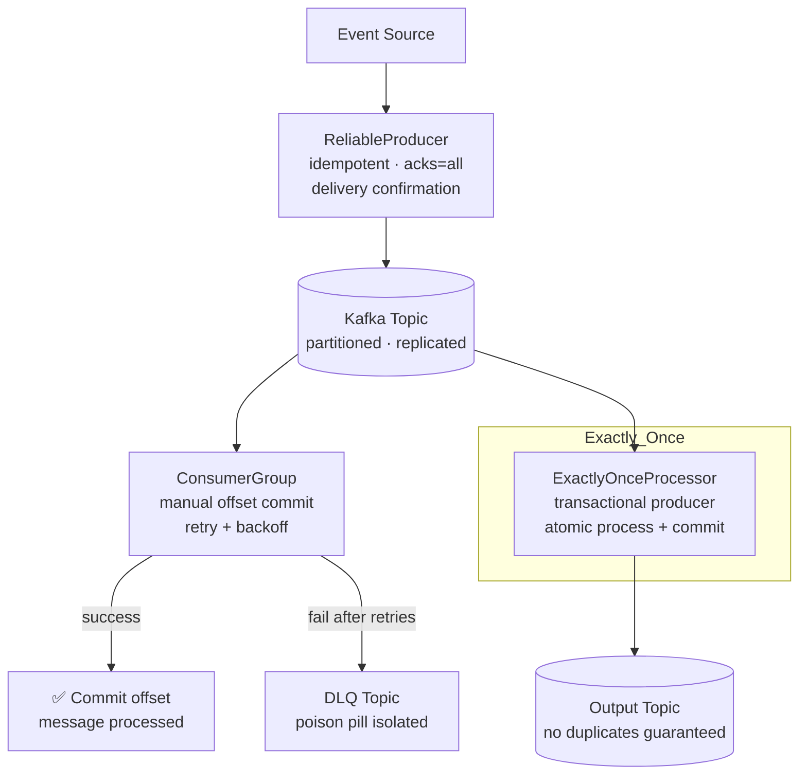

# kafka-patterns


Production Kafka patterns in **Python and Go** — from reliable producer to LLM inference telemetry streaming and real-time anomaly detection.

Built against patterns used in Confluent Cloud, WarpStream, and AI infrastructure platforms that stream millions of model invocation events daily.

---

## The Problem → Solution → Impact

| | |
|---|---|
| **Problem** | At-least-once delivery creates duplicates. Auto-commit loses messages on crash. No DLQ means one bad message blocks an entire partition indefinitely. |
| **Solution** | Three composable patterns: idempotent producer with delivery confirmation, consumer group with manual offset commit + retry, and transactional exactly-once for critical paths. |
| **Impact** | Zero message loss, no duplicate side effects, poison pill messages routed to DLQ instead of blocking consumption. |

---

## System Design



---

## Patterns

### 1. Reliable Producer (Python + Go)

```python
from python.patterns.producer import ProducerConfig, Message, ReliableProducer

config = ProducerConfig(
    bootstrap_servers="localhost:9092",
    topic="order-events",
    acks="all",           # all replicas must ack — no data loss
    idempotence=True,     # exactly-once per partition
)
producer = ReliableProducer(config)

report = producer.send(Message(
    key="order-123",
    value={"type": "order_placed", "amount": 99.99},
))
assert report.succeeded   # confirmed by broker, not fire-and-forget
print(f"Delivered to partition {report.partition} offset {report.offset}")
```

**Why `acks=all`:** With `acks=1` (default), the leader acknowledges before replication. If the leader fails before replication, data is lost. `acks=all` waits for all in-sync replicas — zero data loss.

---

### 2. Consumer Group with Manual Commit (Python + Go)

```python
from python.patterns.consumer import ConsumerConfig, ConsumerGroup, CommitMode

def process_order(msg):
    # Your business logic here
    return save_to_database(msg.value)  # True on success

group = ConsumerGroup(
    ConsumerConfig(
        bootstrap_servers="localhost:9092",
        group_id="order-processor",
        topics=["order-events"],
        commit_mode=CommitMode.MANUAL,   # commit only after processing
    ),
    processor=process_order,
    dlq_topic="order-events-dlq",       # failed messages go here, not stuck
    max_retries=3,
)
group.run()
print(group.stats())
# {'total': 1000, 'succeeded': 998, 'failed': 2, 'dlq_routed': 2}
```

**Why manual commit:** Auto-commit advances the offset on a timer regardless of whether processing succeeded. With manual commit, if your process crashes mid-message, the offset stays at the failed message — it's reprocessed on restart. No data loss.

---

### 4. LLM Inference Event Streaming

```python
from python.patterns.llm_event_stream import LLMInvocationEvent, LLMEventStream
from python.patterns.inference_monitor import InferenceMonitor

stream = LLMEventStream(bootstrap_servers="localhost:9092")
monitor = InferenceMonitor(latency_slo_ms=2000, error_rate_threshold=0.05)

# After every LLM API call — stream the telemetry event
event = LLMInvocationEvent(
    model="claude-3-5-sonnet", provider="bedrock",
    input_tokens=850, output_tokens=320,
    latency_ms=1240, caller_id="oncall-triage-agent",
    cost_usd=0.0035, trace_id="span-abc123",
)
stream.publish(event)

# Consumer-side: detect anomalies in real time
anomalies = monitor.process(event)
for a in anomalies:
    if a.severity == "PAGE":
        alert_oncall(str(a))
# [PAGE] LATENCY_SLO bedrock/claude-3-5-sonnet: p95=4200ms exceeds SLO 2000ms

# Cost visibility per caller
print(stream.stats())
# {'total_events': 247, 'total_cost_usd': 0.8645, 'avg_latency_ms': 1340.2}

# Identify degraded provider for rerouting
slow = monitor.slowest_provider()
# "openai/gpt-4o" — route away until recovered
```

**Why stream LLM telemetry:** At millions of calls/day, batch analytics are too slow for incident response. Streaming every invocation enables p95 latency SLOs (page before users notice), per-caller cost enforcement, and provider health monitoring — all in real time.

---

### 3. Exactly-Once with Transactions (Python)

```python
from python.patterns.exactly_once import TransactionalConfig, ExactlyOnceProcessor

processor = ExactlyOnceProcessor(
    TransactionalConfig(
        bootstrap_servers="localhost:9092",
        transactional_id="payment-processor-1",  # unique per instance
        input_topic="payments-raw",
        output_topic="payments-processed",
        consumer_group="payment-group",
    ),
    transform=lambda msg: {**msg, "processed": True, "fee": msg["amount"] * 0.02},
)
count = processor.process_batch(messages)
# Output messages are invisible until transaction commits — no partial writes
```

**When to use:** Payment processing, inventory updates, anything where duplicate processing causes real-world harm. Cost: ~25% throughput reduction. Use only when idempotent consumers aren't possible.

---

## Project Structure

```
kafka-patterns/
├── python/
│   ├── patterns/
│   │   ├── producer.py          # Reliable producer, idempotent delivery
│   │   ├── consumer.py          # Consumer group, manual commit, DLQ routing
│   │   ├── exactly_once.py      # Transactional exactly-once processing
│   │   ├── consumer_lag.py      # Partition lag monitoring, trend detection
│   │   ├── schema_registry.py   # Schema registration, wire format, compatibility
│   │   ├── llm_event_stream.py  # LLM invocation telemetry streaming
│   │   └── inference_monitor.py # Real-time anomaly detection, SLO enforcement
│   └── tests/
│       ├── test_producer.py     # 7 tests
│       ├── test_consumer.py     # 7 tests
│       ├── test_consumer_lag.py # 12 tests
│       ├── test_schema_registry.py # 9 tests
│       └── test_llm_inference.py   # 11 tests
├── go/
│   ├── producer/
│   │   ├── producer.go
│   │   └── producer_test.go     # 6 tests
│   └── consumer/
│       ├── consumer.go
│       └── consumer_test.go     # 5 tests
└── go.mod
```

---

## Design Decisions & Trade-offs

**Manual commit over auto-commit:**
Auto-commit risks message loss — offset advances before processing completes. Manual commit ensures offset advances only after successful processing. The tradeoff: you must handle duplicate delivery (at-least-once) in your processing logic.

**DLQ over infinite retry:**
Without a DLQ, one malformed "poison pill" message blocks an entire partition indefinitely — all subsequent messages wait behind it. DLQ routes the bad message to a separate topic for inspection, unblocking the partition immediately.

**Idempotent producer by default:**
Idempotence (enable.idempotence=true) ensures the broker deduplicates retried produce requests. Without it, a network timeout causes the producer to retry, potentially writing the message twice. Cost: negligible. Benefit: no duplicates from producer retries.

**Transactional ID uniqueness:**
Each transactional producer instance must have a unique transactional ID. Reusing the same ID across instances causes a fence — the old instance is killed when the new one initializes. This prevents split-brain in exactly-once scenarios.

---

## Running Tests

```bash
pip install pytest
pytest python/tests/ -v
```

---

## Part of the Agentic Infrastructure Stack

| Repo | What It Is |
|------|-----------|
| **[workflow-orchestration-patterns](https://github.com/TushGoel/workflow-orchestration-patterns)** | Step Functions + SQS (Kafka-equivalent) orchestration |
| **[platform-observability](https://github.com/TushGoel/platform-observability)** | SLOs for event pipeline reliability |
| **[kafka-patterns](https://github.com/TushGoel/kafka-patterns)** | ← You are here: Kafka producer/consumer patterns |

---

## License

MIT
